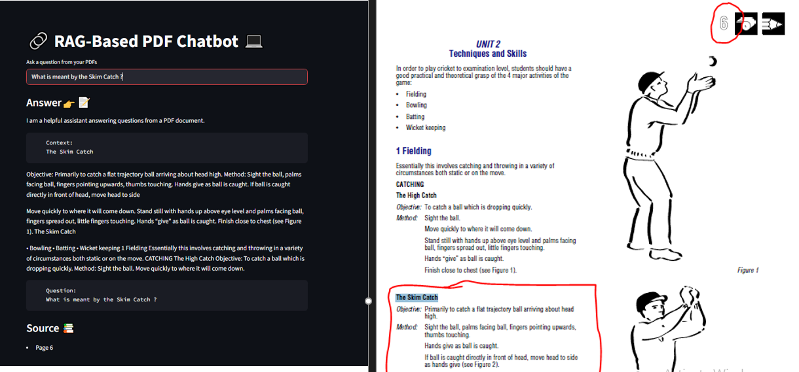

# 🤖 RAG-Based-Chatbot

<p align="center">
  
</p>

<p align="center">
  
  
  
  
</p>

---

## 📌 Overview

This project is an AI-powered application that uses **Retrieval-Augmented Generation (RAG)** to answer questions based on custom documents.
It combines **LLMs, embeddings, and vector databases** to provide accurate contextual responses.

---

## 🚀 Features

* 📄 Document ingestion and processing
* 🔎 Semantic search using vector embeddings
* 🧠 Context-aware AI responses
* ⚡ Fast retrieval with FAISS vector database
* 💬 Simple interactive UI

---

## 🏗️ Project Structure

```
AI-project
│
├── app.py
├── create_vectorstore.py
├── requirements.txt
├── README.md
│
├── src
│   ├── chatbot.py
│   └── retriever.py
│
└── data
    └── documents
```

---

## ⚙️ Installation

Clone the repository

```
git clone https://github.com/Aditya-Ai1107/Ai-projects.git
cd project-name
```

Create virtual environment

```
python -m venv .venv
```

Activate environment

Windows

```
.venv\Scripts\activate
```

Install dependencies

```
pip install -r requirements.txt
```

---

## ▶️ Run the Project

Create the vector database

```
python create_vectorstore.py
```

Start the application

```
python app.py
```

---

## 🧠 Tech Stack

* Python
* LangChain
* FAISS
* HuggingFace Transformers
* Streamlit / Gradio

---

## 📸 Demo

<p align="center">
  
</p>

---

## 📖 Document Reffered

data/Cricket.pdf

The chatbot analyzes the above document and searches the results as per
the questions asked.

---

## 🎯 Future Improvements

* Add support for multiple document formats
* Deploy using Docker
* Add memory-based conversation support
* Improve UI/UX

---

## 🤝 Contributing

Contributions are welcome!
Feel free to open issues or submit pull requests.

---

## 📜 License

This project is licensed under the MIT License.

## Author

Aditya Jagdale
